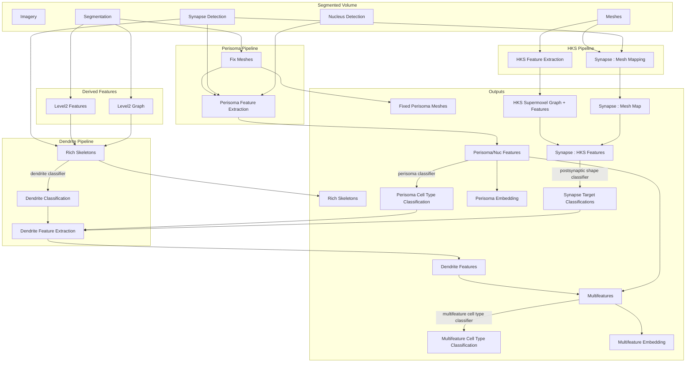

# data-pipeline-sketching

## Proposal for standardization, portability, reproducibility
- Every node on this chart that takes in data -> outputs data should
    - Be a Python function in a library on PyPI
    - Have a well specified environment (implied by the above)
    - Take in those data objects + config/parameters. Parms can be specified in a file (yaml/toml)?
    - If the function needs something else, update the diagram
- Every classifier on this chart should
    - Be stored on the Huggingface hub with a model card
    - The model card should specify what code generated the features (see above)
- Every data output node on this chart should
    - Be in a standard format per type (TBD what these will be, e.g. parquet/delta for tables, .ply or something for mesh, etc.)
    - Be indexed in the catalog service  
